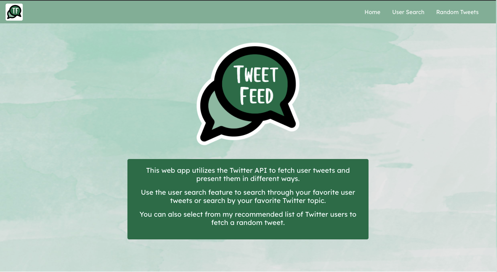
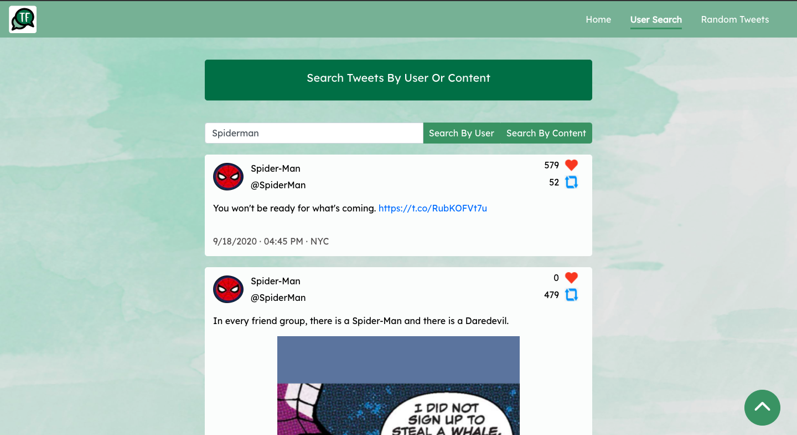
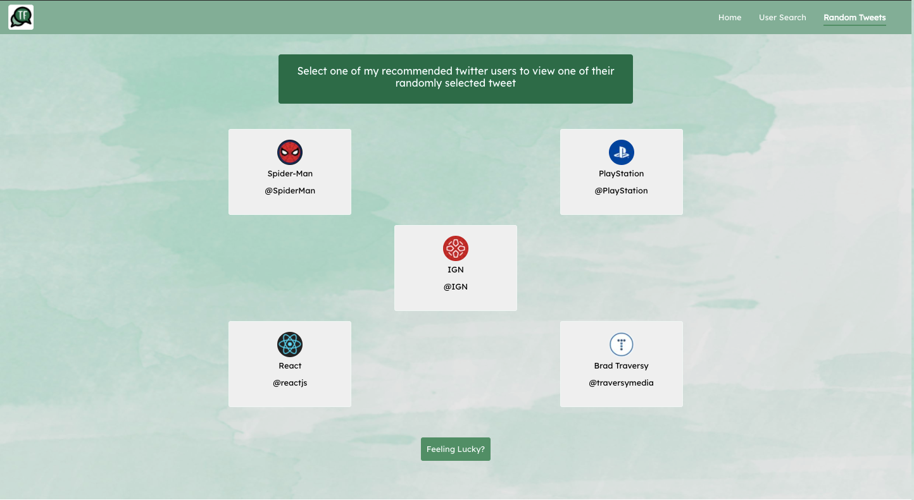

# Tweet Feed

Try it out! [Application Link](https://ar-tweet-feed.herokuapp.com/)

The application utilizes twitter and an internal api to fetch and display filtered tweets.

###### Home Page

###### Search Tweets Page

###### Random Tweets Page

## Description
This project utilizes the Twitter API, which communicates with my internal API using Nodejs and Expressjs. In this application, you can search tweets in a user's timeline or use search all tweets by content. Users will also be able to see random tweets from my favorite list of Twitter user accounts, or you can press a button to select a random user and a random tweet from my list. 

Working on this project has taught me a lot of how backend and frontend communicate by utilizing the Express.js framework and Node.js. I've learned about hosting my server through Express to create my API to filter/parse data from Twitter's API. This knowledge will help me prepare for larger projects where a middleware API is needed to facilitate communication between multiple applications.

## Technologies/Design

###### Technology Stack
- HTML, CSS, JavaScript - Front End Stack
- React - Front End Framework
- Node.js and Express.js - Backend Stack

###### Other Tools
- Google's Draw.IO to help with initial project design and structure. [Diagram](https://drive.google.com/file/d/1fp8kN2SZyzLquBkoplWM_Ok0oyQqpofA/view?usp=sharing)

NOTE: This diagram only shows the steps taken before starting the project. Does not represent final draft. 

## Author
- Aliel Reyes - Software Developer [Github](https://github.com/Areyesfigueroa) | [LinkedIn](https://www.linkedin.com/in/alielreyes/) | [Website](https://alielreyes.netlify.app/)

